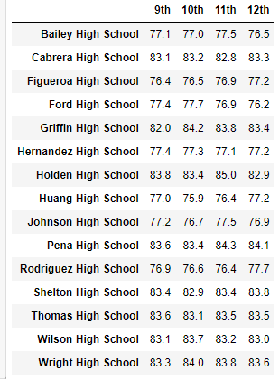
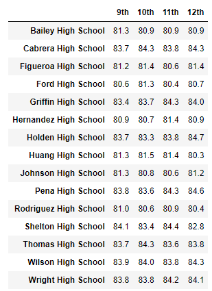

# School District Analysis

## Project Overview

An analysis of a school district was completed and included a high level snapshot of the district's metrics, a per school overview of metrics, school performance based on budget per student, school size, and type of school.  In addition to the overall passing rate for the top 5 and bottom 5 schools, the average math and reading scores received by students in each grade at each school were analyzed.  However, the school board was notified of suspected academic dishonesty surrounding the ninth grade scores at Thomas High School.  Therefore, it was necessary to eliminate these scores and re-run the analysis.

## Purpose
Determine the effects on the school district when removing ninth grade scores from Thomas High School.

## Resources
- Data Sources: [students_complete.csv](Resources/students_complete.csv), [schools_complete.csv](Resources/schools_complete.csv)
- Software: Python 3.7.10, Jupyter Notebook 6.3.0

## Process
The analysis was completed using the pandas and numpy dependencies.  After an initial review of the data sources, it was determined that cleaning the student data was in order to remove any prefixes or suffixes in the student name before proceeding further.  Then with clean student data, the student dataframe was then able to be modified to replace ninth grade math and reading scores at Thomas High School with "nan". This was accomplished by employing the loc function to select all ninth grade math and reading scores to be replaced with "nan".

```
student_data_df.loc[(student_data_df["school_name"] == "Thomas High School") & (student_data_df["grade"] == "9th"), "reading_score"] = np.nan

student_data_df.loc[(student_data_df["school_name"] == "Thomas High School") & (student_data_df["grade"] == "9th"), "math_score"] = np.nan

```


Next it was necessary to revise the District summary.  To begin, a new student count must be determined to account for the removal of ninth graders from the calculations.  Then we can use the new student count in the percentage calculations in order to complete the revised dataframe for the district summary.

```
# Step 1. Get the number of students that are in ninth grade at Thomas High School.
# These students have no grades. 
thomas_ninth_graders = school_data_complete_df.loc[(school_data_complete_df["school_name"] == "Thomas High School") 
                                                   & (school_data_complete_df["grade"] == "9th"), "Student ID"].count()
# Get the total student count 
student_count = school_data_complete_df["Student ID"].count()


# Step 2. Subtract the number of students that are in ninth grade at 
# Thomas High School from the total student count to get the new total student count.

new_student_count = student_count - thomas_ninth_graders

# Calculate the passing rates using the "clean_student_data".
passing_math_count = school_data_complete_df[(school_data_complete_df["math_score"] >= 70)].count()["student_name"]
passing_reading_count = school_data_complete_df[(school_data_complete_df["reading_score"] >= 70)].count()["student_name"]

# Step 3. Calculate the passing percentages with the new total student count.
passing_math_percentage = passing_math_count / float(new_student_count) * 100
passing_reading_percentage = passing_reading_count / float(new_student_count) * 100

# Calculate the students who passed both reading and math.
passing_math_reading = school_data_complete_df[(school_data_complete_df["math_score"] >= 70)
                                               & (school_data_complete_df["reading_score"] >= 70)]

# Calculate the number of students that passed both reading and math.
overall_passing_math_reading_count = passing_math_reading["student_name"].count()


# Step 4.Calculate the overall passing percentage with new total student count.
overall_passing_percentage = overall_passing_math_reading_count / float(new_student_count) * 100
```
With the scores and percentages updated, the revised District Summary dataframe can now be generated.

Next in order to update the School Summary dataframe, it was necessary to recalculate and replace all of the score and percentage data for Thomas High School without the ninth graders.

```
# Step 5.  Get the number of 10th-12th graders from Thomas High School (THS).
ths_tenth_to_twelfth_count = per_school_summary_df.loc["Thomas High School", "Total Students"] - thomas_ninth_graders

# Step 6. Get all the students passing math from THS
ths_passing_math = school_data_complete_df.loc[(school_data_complete_df["school_name"] == "Thomas High School") & (school_data_complete_df["math_score"] >= 70)]

# Step 7. Get all the students passing reading from THS
ths_passing_reading = school_data_complete_df.loc[(school_data_complete_df["school_name"] == "Thomas High School") & (school_data_complete_df["reading_score"] >= 70)]

# Step 8. Get all the students passing math and reading from THS
ths_passing_math_reading = school_data_complete_df.loc[(school_data_complete_df["school_name"] == "Thomas High School") & (school_data_complete_df["math_score"] >= 70) & (school_data_complete_df["reading_score"] >= 70)]

# Step 9. Calculate the percentage of 10th-12th grade students passing math from Thomas High School. 
percentage_ths_passing_math = (ths_passing_math.count()["student_name"] / ths_tenth_to_twelfth_count) * 100

# Step 10. Calculate the percentage of 10th-12th grade students passing reading from Thomas High School.
percentage_ths_passing_reading = (ths_passing_reading.count()["student_name"] / ths_tenth_to_twelfth_count) * 100

# Step 11. Calculate the overall passing percentage of 10th-12th grade from Thomas High School. 
percentage_ths_passing_overall = (ths_passing_math_reading.count()["student_name"] / ths_tenth_to_twelfth_count) * 100

# Step 12. Replace the passing math percent for Thomas High School in the per_school_summary_df.
per_school_summary_df.loc[["Thomas High School"], ["% Passing Math"]] = percentage_ths_passing_math

# Step 13. Replace the passing reading percentage for Thomas High School in the per_school_summary_df.
per_school_summary_df.loc[["Thomas High School"], ["% Passing Reading"]] = percentage_ths_passing_reading

# Step 14. Replace the overall passing percentage for Thomas High School in the per_school_summary_df.
per_school_summary_df.loc[["Thomas High School"], ["% Overall Passing"]] = percentage_ths_passing_overall
```

This yielded the revised school summary dataframe.

Then we proceeded to update the math and reading scores by grade, spending summary, size summary and type summary all by utilizing the groupby function.

With all new dataframes created, we can now determine the effects of the removal of ninth grade scores.

## Results

- The district summary was not severely impacted by the removal of ninth grade score's from Thomas High School. With the exception of the Average Reading Score, the other categories experienced nominal decreases ranging from 0.1% to 0.3%.

Original District Summary
 

Revised District Summary
 

- The school summary was also not impacted tremendously by the changes made to Thomas High School.  Thomas High School remained the second highest performing high school when ranked by % Overall Passing.
Original School Summary ordered by descending % Overall Passing results (displaying top five schools)
 

Revised School Summary ordered by descending % Overall Passing results (displaying top five schools)
 

- When replacing the ninth grade math scores with NaN, the average math score for Thomas High School (THS) decreases from 83.42 to 83.35.  THS now falls in line with Griffin and Shelton High School's math scores, which were 83.35 and 83.36 respectively.  In regards to the Average Reading Score for THS, the score had a nominal increase from 83.8 to 83.9.  Interestingly, while the average reading score did increase, the % passing reading fell from 97.31% to 97.02%.  Yet, THS still has one of the highest average reading scores amongst the other schools.  Only 4 other schools had higher reading scores: Cabrera High School, Pena High School, Wilson High School and Wright High School.  

- In addition to revising the district and school summaries, the following was also reviewed for impact when removing ninth grade scores at Thomas High School:
  - Math and reading scores by grade were not impacted.  Ninth grade scores at Thomas High School reflected "nan" but all other scores remained stable as seen in the below screenshots.
  Original Math Scores by Grade vs. Revised Math Scores by Grade

      

   Original Reading Scores by Grade vs. Revised Reading Scores by Grade

       

   - In the original analysis performed, schools with the highest level of spending per student were in fact the lowest in the % Overall Passing.  In fact it the highest performing schools in the % Overall Passing were those in lowest spending range of "< $584".  This was observed not only in % Overall Passing but in all categories across the board.  The lowest funded schools had the best performance.  This did not change upon removal of the ninth grade scores from Thomas High School.  The findings remained the same in the revised analysis.

  

   - Next performance was categorized by the size of the school.  Three categories were used: small, medium, and large.  It is noted that the medium sized schools had the overall best passing percentage.  Small schools performed similar to the the medium schools but the large schools greatly underperformed by comparision across the board.  This did not change upon the removal of the ninth grade scores.

 

   - When looking at performance based on the type of school, charter vs district, there was no change upon removing ninth grade scores.  It remains that Charter schools continue to outperform the District schools across the board.

 

## Summary

In conclusion, the district analysis experienced some changes due to the removal of ninth grade scores.  The District Summary revealed nominal decreases in most categories.  The greatest decrease was 0.3% in the % Overall Passing.  The Average Reading Score did not change.  The performance of Thomas High School, a medium sized school that spends a range of $630-644 per student, in relation to the other schools did not change much.  Thomas High School remained the second highest performing school by % Overall Passing.  However, Thomas High School did experience a decrease in the Average Math Score by 0.07%, a decrease of 0.1% in the % Passing Math, and a decrease of .3% in the % Passing Reading.  